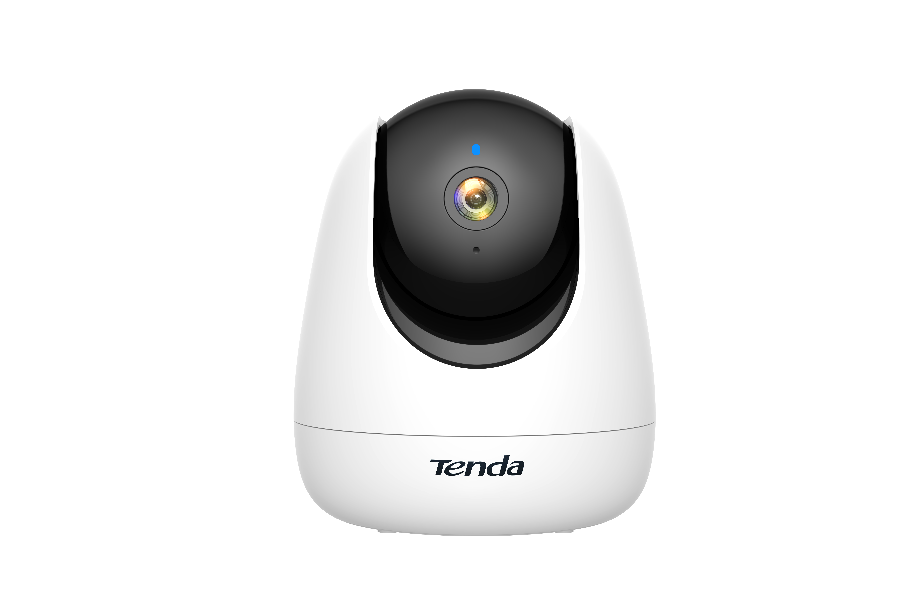

# Tenda CP3 Research output

    

## Description
This page contains the details of different CVEs found in the security analysis of the Tenda CP3 camera.

## Table of content

| CVE ID                  | Name    | Link          |
| ----------------------- | ------- | ------------- |
| CVE-XXXX-XXXX (TBA) | Network Credentials Disclosure | [GitHub](CP3/tmp_NCD.md) |
| CVE-XXXX-XXXX (TBA) | Physical Root Access | [GitHub](CP3/tmp_PRA.md) |
| CVE-XXXX-XXXX (TBA) | Physical Bootloader Access | [GitHub](CP3/tmp_PBA.md) |
| CVE-XXXX-XXXX (TBA) | Remote Root Access | [GitHub](CP3/tmp_RRA.md) |
| CVE-XXXX-XXXX (TBA) | RTSP Access | [GitHub](CP3/tmp_RTSPa.md) |
| CVE-XXXX-XXXX (TBA) | Malicious Upgrade | [GitHub](CP3/tmp_MU.md) |
| CVE-XXXX-XXXX (TBA) | Unauthenticated RCE | [GitHub](CP3/tmp_uRCE.md) |

