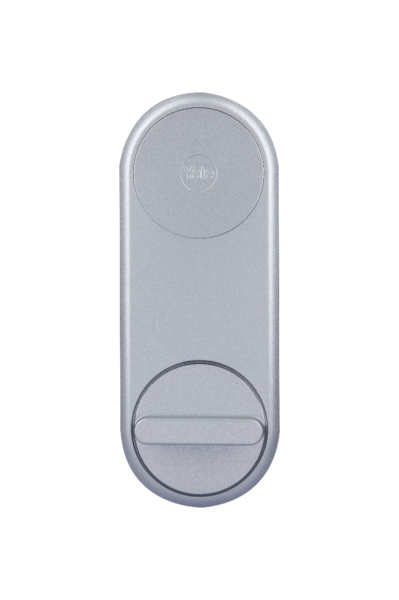

# Yale Linus Smart Lock Research output

## Description

This page contains the details of the CVE found in the security analysis of the Yale Linus Smart Lock device and their respective companion app.

## Table of content

| CVE ID | Name | Link |
| ------ | ---- | ---- |
| [Yale-PA-2024-nn](https://www.assaabloy.com/group/en/about-us/product-security/security-advisory) | Account takeover via Yale Home mobile API | [1](Yale-Home-API/Yale-PA-2024-nn.md) |

## Authors

 - [Michele Mosca](https://github.com/MicheleMosca)
 - [Filip Valgimigli](http://personale.unimore.it/Rubrica/dettaglio/filgimigli)
 - [Dario Stabili](https://www.unibo.it/sitoweb/dario.stabili) 
 - [Mirco Marchetti](https://personale.unimore.it/rubrica/dettaglio/mmarchetti)